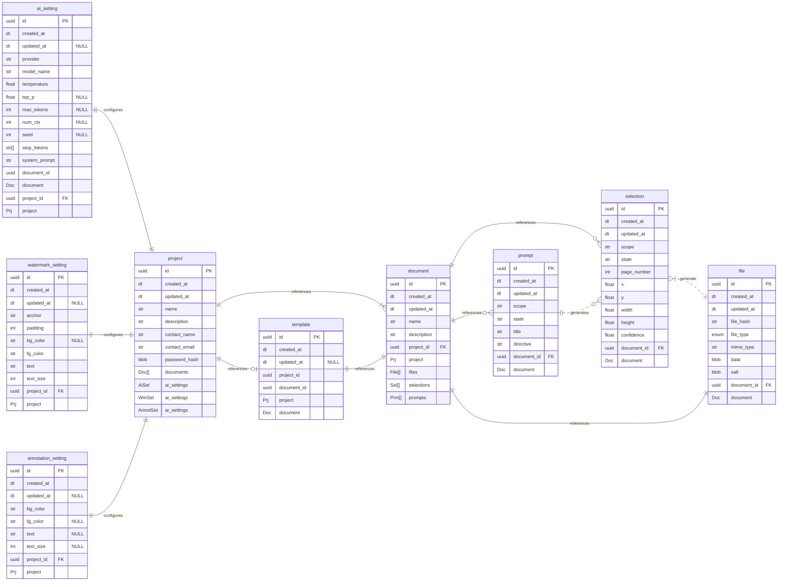

```mermaid
erDiagram
    direction LR

    project {
        uuid id PK
        dt created_at
        dt updated_at
        str name
        str description
        str contact_name
        str contact_email
        blob password_hash
        Doc[] documents
        AiSet ai_settings
        WmSet ai_settings
        AnnotSet ai_settings
    }

    document {
        uuid id PK
        dt created_at
        dt updated_at
        str name
        str description
        uuid project_id FK
        Prj project
        File[] files
        Sel[] selections
        Prm[] prompts
    }

    file {
        uuid id PK
        dt created_at
        dt updated_at
        str file_hash
        enum file_type
        str mime_type
        blob data
        blob salt
        uuid document_id FK
        Doc document
    }

    selection {
        uuid id PK
        dt created_at
        dt updated_at
        str scope
        str state
        int page_number
        float x
        float y
        float width
        float height
        float confidence
        uuid document_id FK
        Doc document
    }

    prompt {
        uuid id PK
        dt created_at
        dt updated_at
        str scope
        str state
        str title
        str directive
        uuid document_id FK
        Doc document
    }

    watermark_setting {
        uuid id PK
        dt created_at
        dt updated_at "NULL"
        str anchor
        int padding
        str bg_color "NULL"
        str fg_color
        str text
        int text_size
        uuid project_id FK
        Prj project
    }

    annotation_setting {
        uuid id PK
        dt created_at
        dt updated_at "NULL"
        str bg_color
        str fg_color "NULL"
        str text "NULL"
        int text_size "NULL"
        uuid project_id FK
        Prj project
    }

    ai_setting {
        uuid id PK
        dt created_at
        dt updated_at "NULL"
        str provider
        str model_name
        float temperature
        float top_p "NULL"
        int max_tokens "NULL"
        int num_ctx "NULL"
        int seed "NULL"
        str[] stop_tokens
        str system_prompt
        uuid document_id
        Doc document
        uuid project_id FK
        Prj project
    }

    template {
        uuid id PK
        dt created_at
        dt updated_at "NULL"
        uuid project_id
        uuid document_id
        Prj project
        Doc document
    }

    project ||--|{ document : references
    project ||--O| template : references
    file ||--|| document : references
    template ||--|| document : references

    ai_setting ||--|| project : configures
    watermark_setting ||--|| project : configures
    annotation_setting ||--|| project : configures
    
    document||--O{ selection : references
    document ||--O{ prompt : references
    prompt ||..O{ selection : generates
    selection }|..|| file : generate
```