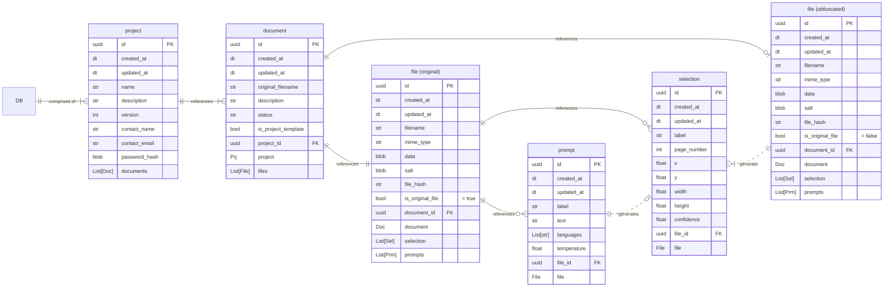

```mermaid
erDiagram
    direction LR

    project {
        uuid id PK
        dt created_at
        dt updated_at
        str name
        str description
        int version
        str contact_name
        str contact_email
        blob password_hash
        List[Doc] documents
    }

    document {
        uuid id PK
        dt created_at
        dt updated_at
        str original_filename
        str description
        str status
        bool is_project_template
        uuid project_id FK
        Prj project
        List[File] files
    }

    "file (original)" {
        uuid id PK
        dt created_at
        dt updated_at
        str filename
        str mime_type
        blob data
        blob salt
        str file_hash
        bool is_original_file "= true"
        uuid document_id FK
        Doc document
        List[Sel] selection
        List[Prm] prompts
    }

    "file (obfuscated)" {
        uuid id PK
        dt created_at
        dt updated_at
        str filename
        str mime_type
        blob data
        blob salt
        str file_hash
        bool is_original_file "= false"
        uuid document_id FK
        Doc document
        List[Sel] selection
        List[Prm] prompts
    }

    selection {
        uuid id PK
        dt created_at
        dt updated_at
        str label
        int page_number
        float x
        float y
        float width
        float height
        float confidence
        uuid file_id FK
        File file
    }

    prompt {
        uuid id PK
        dt created_at
        dt updated_at
        str label
        str text
        List[str] languages
        float temperature
        uuid file_id FK
        File file
    }

    DB ||--|{ project : "comprised of"
    project ||--|{ document : references
    document ||--|| "file (original)" : references
    document ||--O| "file (obfuscated)" : references
    "file (original)" ||--O{ selection : references
    "file (original)" ||--O{ prompt : references
    prompt ||..O| selection : generates
    selection }|..|| "file (obfuscated)" : generate
```