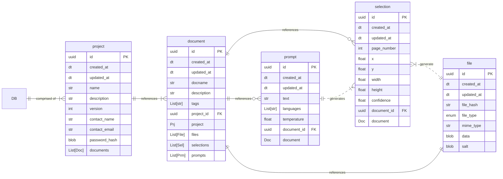

```mermaid
erDiagram
    direction LR

    project {
        uuid id PK
        dt created_at
        dt updated_at
        str name
        str description
        int version
        str contact_name
        str contact_email
        blob password_hash
        List[Doc] documents
    }

    document {
        uuid id PK
        dt created_at
        dt updated_at
        str docname
        str description
        List[str] tags
        uuid project_id FK
        Prj project
        List[File] files
        List[Sel] selections
        List[Prm] prompts
    }

    file {
        uuid id PK
        dt created_at
        dt updated_at
        str file_hash
        enum file_type
        str mime_type
        blob data
        blob salt
    }

    selection {
        uuid id PK
        dt created_at
        dt updated_at
        int page_number
        float x
        float y
        float width
        float height
        float confidence
        uuid document_id FK
        Doc document
    }

    prompt {
        uuid id PK
        dt created_at
        dt updated_at
        str text
        List[str] languages
        float temperature
        uuid document_id FK
        Doc document
    }

    DB ||--|{ project : "comprised of"
    project ||--|{ document : references
    file ||--|| document : references
    document||--O{ selection : references
    document ||--O{ prompt : references
    prompt ||..|{ selection : generates
    selection }|..|| file : generate
```